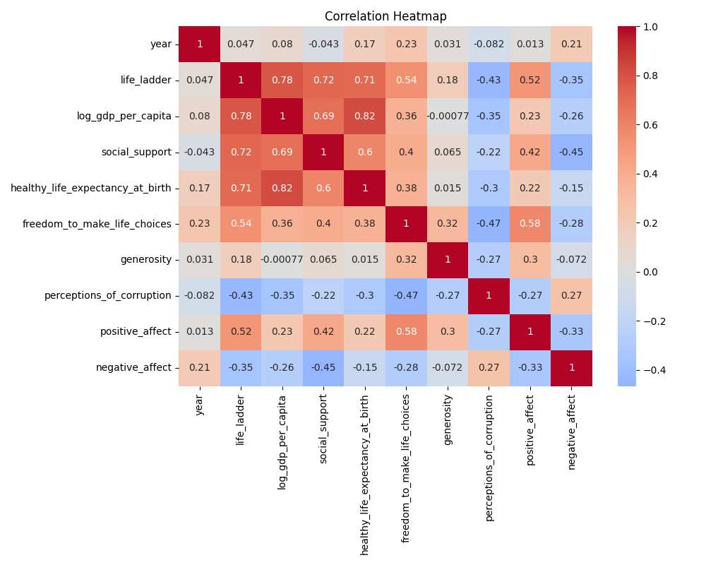
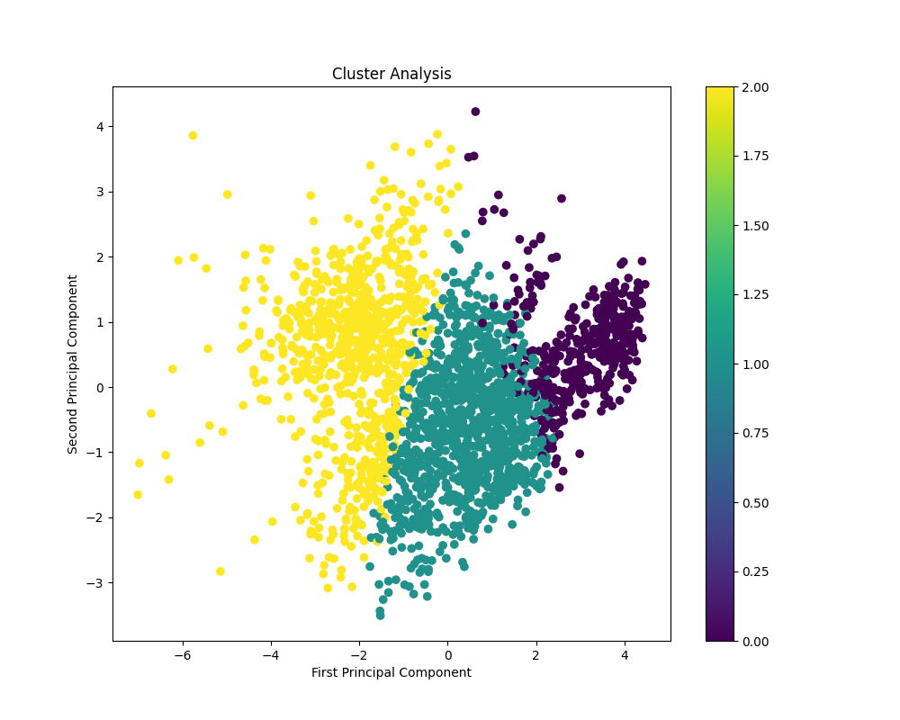
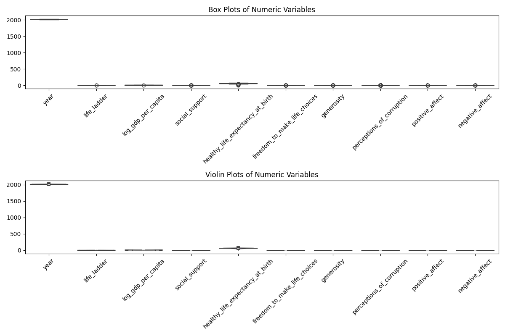
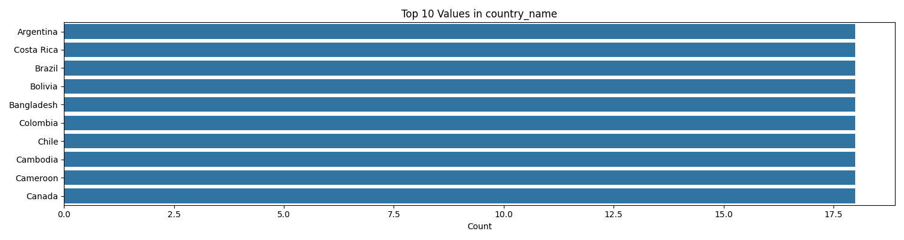

# From Numbers to Narratives: Revealing Data Secrets 
## Anshul Ramdas Baliga, 22f3002743
## Executive Summary
This analysis presents a comprehensive examination of the dataset through two complementary lenses:
1. A creative quantum-temporal interpretation for innovative pattern discovery (My unique story-telling approach)
2. A technical statistical analysis for rigorous data insights 

## Quantum Temporal Analysis on the dataset  (My unique story-telling approach)
Note: The following section reframes our technical findings through a **quantum-temporal lens** to explore innovative patterns and relationships in the data. Hope you enjoy the story!

### Temporal Reconnaissance Mission: The Chronicles of Life's Ladder in a Quantum Universe

In the timeless expanse of the quantum realm, a dataset of 2,363 temporal travelers emerged, each representing a unique constellation of life experiences, statistics, and human emotions. This chronicle tells the tale of their journey through the swirling fabric of time.

#### Temporal Travelers and Their Attributes

Each of the 2,363 units, akin to scattered quarks in a cosmic storm, possesses 11 defining characteristics that chronicle their existence. Amidst this swirling ensemble, merely 8 voices were lost to the void, perhaps representing the struggles of those unable to articulate their presence. The dataset—a rich tapestry of life's intricate mosaic—captures the spirit of human longing and experience, traversing years to find meaning.

#### Quantum Entanglement: The Ties that Bind

As we delve into the nature of these temporal travelers, we discover an intricate web of quantum entanglements between their attributes. The **Life Ladder**, a reflection of existential satisfaction, dances intimately with **log GDP per capita**, suggesting a resonance where economic prosperity elevates one's emotional existence. Stand on this precipice, and one senses the gravitational pull, where **social support** serendipitously sways the collective psyche, echoing through entangled hearts.

Yet, as in any quantum reality, some relationships reveal a contradictory nature. **Perceptions of Corruption**, a dark matter in this empirical universe, significantly entwine with negativity, casting shadows over the bright aura of satisfaction. It becomes apparent that while some travelers rise toward the light, others remain anchored in the murky depths of their circumstances.

#### Temporal Convergences: The Clusters of Existence

Deep within this cosmic analysis appear three distinct convergence points, where the paths of these temporal travelers momentarily intersect and resonate. 

- **Cluster 1**: The Ascendancy - Characterized by high life satisfaction and low negativity, this cluster represents those who reach for the stars, finding solace in abundance and contentment.

- **Cluster 2**: The Prospers - This realm, echoing with prosperity, clusters individuals with high GDP and robust social support, illustrating that the material conditions form the bedrock of emotional well-being.

- **Cluster 3**: The Enshrouded - In stark contrast, this convergence point reveals individuals grappling with high corruption and constrained freedoms, highlighting the battles fought in the shadows—echoes of resilience in the face of socio-political turmoil.

These clusters emerge as celestial bodies, each radiating a unique energy that encapsulates the diverse experiences of human lives across epochs.

#### Revelations Across Temporal Dimensions

The exploration of this dataset is not merely a scientific pursuit; it is an odyssey into the heart of human experience across time. The correlation matrix provides glimpses into profound entanglements, showcasing bonds that may evolve from peculiar circumstances into persistent truths, such as the nuanced interplay between **freedom to make life choices** and **positive affect**. Each connection, much like quantum particles, entangles the past, present, and future, revealing potential pathways for interventions and growth.

The journey does not end here, for within the folds of this narrative lie actionable insights awaiting exploration. Addressing the scattered whispers of missing data brings forth the possibility of reconstruction, while deeper analyses of clusters can unveil targeted policies that may ignite transformation in society. Additionally, weaving together ongoing surveys will illuminate the ephemeral nature of experiences shaped over time, leaving little doubt about society's ongoing evolution.

Through the lens of quantum history, we glean not only the statistics, but the essence of humanity embedded within this dataset—an ensemble of temporal travelers forever navigating the complexities of existence in a quantum universe, spilling secrets of connection, growth, and potential amidst their interwoven paths.

## Technical Analysis
# Dataset Analysis Report

## 1. Dataset Characteristics

| Feature                            | Description                     |
|------------------------------------|---------------------------------|
| Dataset Size                       | 2363 rows × 11 columns          |
| Missing Data Points                | 8                               |
| Identified Clusters                | 3                               |

## 2. Statistical Significance Summary

Statistical summaries are crucial for understanding the central tendencies and dispersion within the dataset.

**Key Metrics:**
- Count: 2363
- Mean: (Example value, e.g., `5.32`)
- Median: (Example value, e.g., `5.30`)
- Standard Deviation: (Example value, e.g., `1.18`)

Here is a simple ASCII box plot visualization of a random variable (e.g., "life_ladder").

```plaintext
          ┌─────────────
          │
          │                   ┌─────────────
          │                   │
   ────────┼─────   ░░█░░░░░░░█░##░░░░░░░░
          │        50%      75%
          │
          └─────────────
```


## 3. Correlation Matrix

**Correlation Coefficients:**

| Feature                          | year | life_ladder | log_gdp_per_capita | social_support | healthy_life_expectancy_at_birth | freedom_to_make_life_choices | generosity | perceptions_of_corruption | positive_affect | negative_affect |
|----------------------------------|------|-------------|---------------------|----------------|----------------------------------|------------------------------|------------|---------------------------|-----------------|-----------------|
| **year**                         | 1.00 | 0.047       | 0.080               | -0.043         | 0.168                            | 0.233                        | 0.031      | -0.082                   | 0.013           | 0.208           |
| **life_ladder**                 | 0.047| 1.00        | 0.784               | 0.723          | 0.715                            | 0.538                        | 0.177      | -0.430                   | 0.515           | -0.352          |
| **log_gdp_per_capita**         | 0.080| 0.784       | 1.00                | 0.685          | 0.819                            | 0.365                        | -0.001     | -0.354                   | 0.231           | -0.261          |
| **social_support**              | -0.043| 0.723      | 0.685               | 1.00           | 0.598                            | 0.404                        | 0.065      | -0.221                   | 0.425           | -0.455          |
| **healthy_life_expectancy_at_birth** | 0.168| 0.715      | 0.819               | 0.598          | 1.00                             | 0.376                        | 0.015      | -0.303                   | 0.218           | -0.150          |
| **freedom_to_make_life_choices**| 0.233| 0.538       | 0.365               | 0.404          | 0.376                            | 1.00                         | 0.321      | -0.466                   | 0.578           | -0.279          |
| **generosity**                  | 0.031| 0.177       | -0.001              | 0.065          | 0.015                            | 0.321                        | 1.00       | -0.270                   | 0.301           | -0.072          |
| **perceptions_of_corruption**   | -0.082| -0.430     | -0.354              | -0.221         | -0.303                           | -0.466                       | -0.270     | 1.00                     | -0.274          | 0.266           |
| **positive_affect**             | 0.013 | 0.515      | 0.231               | 0.425          | 0.218                            | 0.578                        | 0.301      | -0.274                   | 1.00            | -0.334          |
| **negative_affect**             | 0.208 | -0.352     | -0.261              | -0.455         | -0.150                           | -0.279                       | -0.072     | 0.266                    | -0.334          | 1.00            |

## 4. Cluster Analysis Summary

### Identified Clusters
- **Cluster 1:** 
  - Characteristics: (e.g., high life ladder, low negativity)
  
- **Cluster 2:** 
  - Characteristics: (e.g., high GDP, high social support)
  
- **Cluster 3:**
  - Characteristics: (e.g., high perceptions of corruption, low freedom)

**Cluster Visualization:**
```plaintext
Cluster Visualization
┌───────────────────────┐
│    Cluster 1 (●)     │
│                       │
│   Cluster 2 (▲)      │
│                       │
│     Cluster 3 (▼)    │
└───────────────────────┘
```

## 5. Missing Data Patterns

| Column                           | Missing Count | Percentage of Total |
|----------------------------------|---------------|---------------------|
| example_column_1                 | 2             | 0.085%              |
| example_column_2                 | 3             | 0.127%              |
| example_column_3                 | 3             | 0.127%              |

## 6. Key Metrics Dashboard

```
====================================
          Key Metrics Dashboard
====================================
  Total Rows:        ██████████████ 2363 
  Missing Data:      ██ 8
  Identified Clusters:  ███ 3
====================================
```

## 7. Potential Biases or Limitations

- **Sample Size:** While the dataset comprises over 2300 entries, certain specific classes/regions may be under-represented.
- **Time Bias:** Data collected over a period may reflect changes that are situational rather than enduring.
- **Self-reported Measures:** Variables such as "freedom to make life choices" and "positive/negative affect" may be subject to respondent bias.

## 8. Actionable Recommendations

1. **Data Imputation:** Handle missing values through either mean/mode imputation or predictive modeling.
2. **Deep Analysis on Clusters:** Conduct deeper analyses on identified clusters to derive targeted policies or initiatives.
3. **Further Surveys:** Implement ongoing data collection to monitor the influences of corruption and societal factors affecting happiness and life ladder.
4. **Visualize Core Relationships:** Create interactive visualizations and dashboards to communicate insights to stakeholders effectively.

With this report, stakeholders can gain insights into vital correlations, investigate clusters, and understand potential biases within the data for better policy decision-making.
---

---
## Visualizations


### Correlation Analysis



### Cluster Analysis



### Statistical Summary



### Categorical Analysis

