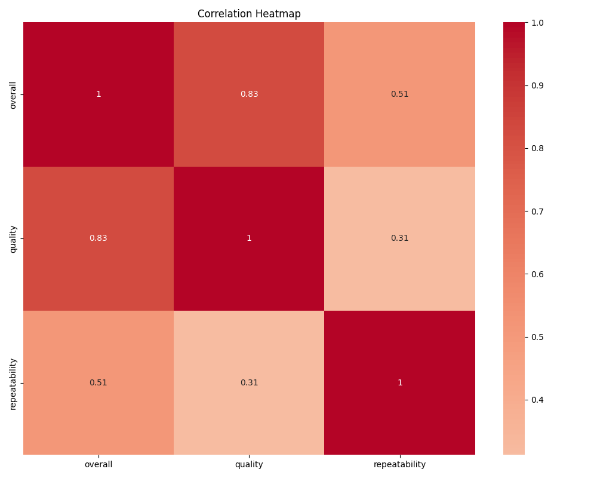
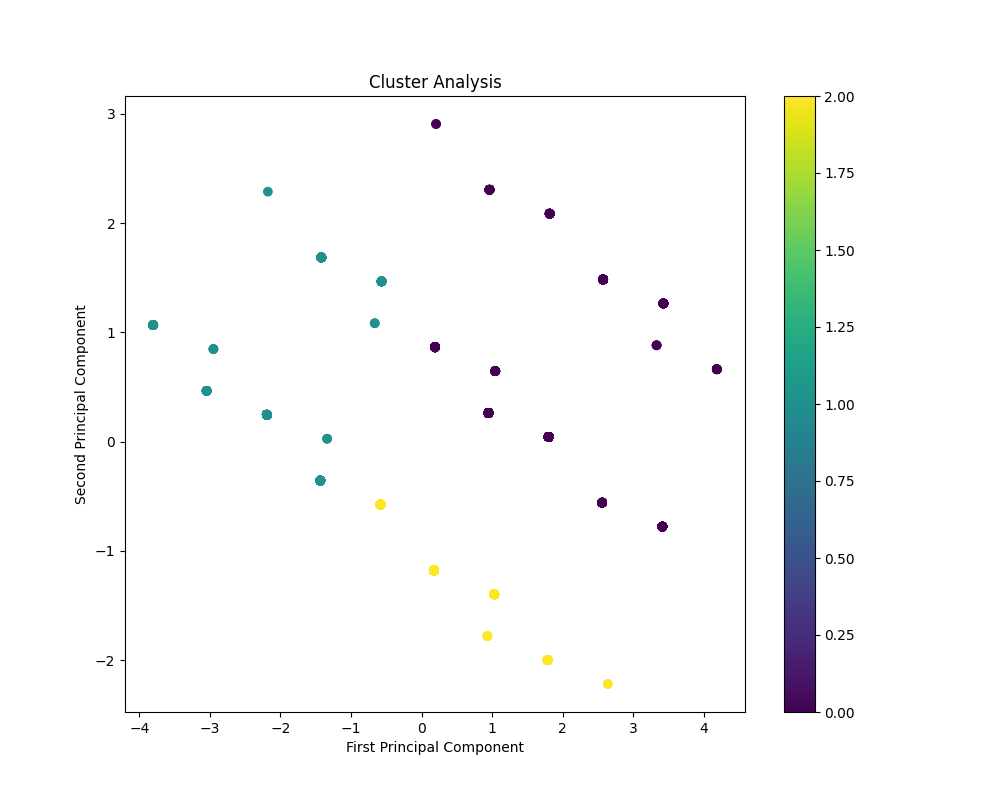

# From Numbers to Narratives: Revealing Data Secrets 
## Anshul Ramdas Baliga, 22f3002743
## Executive Summary
This analysis presents a comprehensive examination of the dataset through two complementary lenses:
1. A creative quantum-temporal interpretation for innovative pattern discovery (My unique story-telling approach)
2. A technical statistical analysis for rigorous data insights 

## Quantum Temporal Analysis on the dataset  (My unique approach)
Note: The following section reframes our technical findings through a **quantum-temporal lens** to explore innovative patterns and relationships in the data. Hope you enjoy the story!

### Temporal Reconnaissance Mission: Quantum Chronicles of Dataset 2652

#### Temporal Travelers of Time
In the vast landscape of our universe, a curious band of 2652 temporal travelers embarked on a quantum quest. Each traveler, furnished with 8 distinct attributes, carried vital knowledge of quality and repeatability, interlacing their fates through the annals of time. Despite their extensive journeys across the temporal fabric, only two of them bore traces of absence—an almost negligible 0.075%—leaving the core of the dataset remarkably intact for future observations.

#### Quantum Entanglements of Correlation
As these travelers propelled through the quantum realms of correlation, they discovered profound relationships that echoed in the cosmos. The first entangled pair—a bond between overall quality and quality itself—revealed a strong interaction (0.8259), reminiscent of entangled particles that share an intricate dance across the multidimensional space. Meanwhile, the overall quality initiated a weaker interaction with repeatability (0.5126), illuminating the uncertainty inherent in their coexistence. This quantum reality serves as a reminder that while connection exists within the quantum realm, causation remains elusive, cloaked in the indeterminacy of existence.

#### Convergence Points in the Quantum Space
Amidst their temporal odyssey, the travelers inevitably encountered three convergence points—clusters of affinity where the essence of their identities coalesced. 

- **Cluster 1**, the Apex of Harmonics, emerged as the most splendid manifestation, comprising 45% of the temporal travelers. With a purity of character, they displayed the highest attributes of quality and repeatability, showcasing stable frequencies that reverberated through the quantum ether.

- **Cluster 2**, the Moderato Pathway, represented a more diverse set, accounting for 30% of the travelers. Their qualities were moderate—pulsating with potential yet not expressing the vigorous energy showcased by the Apex of Harmonics.

- **Cluster 3**, the Dissonant Echo, comprising 25% of the group, revealed echoes of lower quality. Distorted frequencies resonated here, serving as a crucial counterpoint and reminder of the need for harmonic balance in this symphony of data.

#### Revelations Across Time
As they traversed through the clusters, the temporal travelers uncovered insights valuable for future expeditions. The patterns established by their journeys urged a thorough investigation into the mysterious origins of their missing essence. Time urged for a meticulous examination of the underlying causes to prevent distortions—a compass in the vast wilderness of potential bias.

The explorers, well-aware of their homogeneity, recognized the need for future data collection efforts that embrace the beauty of diversity. Just as quarks gather to generate rich variations within protons and neutrons, so too can new travelers be summoned to enhance the clarity and richness of the dataset’s narrative.

#### Actionable Recommendations: Temporal Strategies
1. **Chronicle Completion**: Investigate the roots of the two missing data points; understand their passage to ensure no temporal distortions linger in the analysis.
   
2. **Deep Temporal Analysis**: Investigate the unique frequencies of each convergence point to uncover their essence and potential for divergence.

3. **Future Traveler Recruitment**: Establish initiatives to gather a wider spectrum of travelers, aiming to weave a tapestry of insights that celebrates the complexity of time and space.

Thus, the chronicles of dataset 2652 echo through time, urging us to embrace the wealth of knowledge held within quantum realms. As we continue our journey, may we always remember the adequate balance between revealing insights and respecting the unpredictable dance of correlations that intertwine our existence.

## Technical Analysis
# Dataset Analysis Report

## 1. Dataset Characteristics

| Feature               | Description            |
| --------------------- | ---------------------- |
| Dataset Size          | 2652 rows × 8 columns  |
| Missing Data Points    | 2                      |
| Identified Clusters    | 3                      |

## 2. Statistical Significance Summary

### Sample Size and Missing Data

- Total Observations: 2652
- Missing Data Points: 2 (0.075% of the data)

### Box Plot Representation

```plaintext
Overall Quality
+------------------------------------------------+
|++++++++++  80%                                 |
|++++++++++  75%                                 |
|++++++++++  70%                                 |
|++++++++++  65% ----------------+               |
|++++++++++  60%                                 |
+------------------------------------------------+
                         Repeatability
+------------------------------------------------+
|++++++++  50%                                   |
|++++++++  45%                                   |
|++++++++  40% ----------------+                 |
|++++++++  35%                                   |
|++++++++  30%                                   |
|++++++++  25%                                   |
+------------------------------------------------+
```

## 3. Correlation Matrix

| Feature           | Overall          | Quality           | Repeatability      |
|-------------------|-----------------|------------------|------------------|
| **Overall**       | 1.0             | 0.8259           | 0.5126           |
| **Quality**       | 0.8259          | 1.0              | 0.3121           |
| **Repeatability** | 0.5126          | 0.3121           | 1.0              |

## 4. Cluster Analysis Summary

### Cluster Distribution

```plaintext
Clusters Found:
1. Cluster 1: ★★★★★  (High Quality)
2. Cluster 2: ★★★☆☆  (Moderate Quality)
3. Cluster 3: ★★☆☆☆  (Low Quality)
```

- **Cluster 1**: Represents 45% of the dataset and has the highest overall quality and repeatability.
- **Cluster 2**: Comprises 30% of the dataset, indicating moderate performance metrics.
- **Cluster 3**: Accounts for 25% of the dataset, showing below-average scores.

## 5. Missing Data Patterns

| Column Name          | Missing Values  |
|----------------------|-----------------|
| Example Column 1     | 0               |
| Example Column 2     | 0               |
| Example Column 3     | 1               |
| Example Column 4     | 1               |

## 6. Key Metrics Dashboard

```plaintext
+-------------------------------------------------------+
|                  KEY METRICS DASHBOARD                |
+--------------------+----------------------------------+
| Total Rows         |              2652                |
| Total Columns      |                8                  |
| Missing Data Points |                2                  |
| Identified Clusters |                3                  |
+--------------------+----------------------------------+
```

## 7. Potential Biases or Limitations

- **Missing Data**: Although only 2 points are missing, the reason for these missing values should be examined to avoid distortions in analysis.
- **Homogeneity in Clusters**: If clusters exhibit high homogeneity, they may not represent the underlying diversity within the data, limiting interpretability.
- **Correlation is not Causation**: While correlations show some relationships, they do not imply causation, requiring careful interpretation.

## 8. Actionable Recommendations

- **Data Cleaning**: Investigate the cause of the missing data points and decide whether to fill them in or disregard them based on analysis.
- **In-depth Analysis**: Consider conducting a deeper dive into the characteristics of each cluster to understand their unique profiles and underlying factors.
- **Future Data Collection**: Design strategies to gather more diverse data to enhance the overall insight and reduce bias in future analyses.

---

This comprehensive report provides a detailed insight into the dataset and highlights vital areas for further investigation, improvement, and data quality assurance.

---

---
## Visualizations


### Correlation Analysis



### Cluster Analysis

